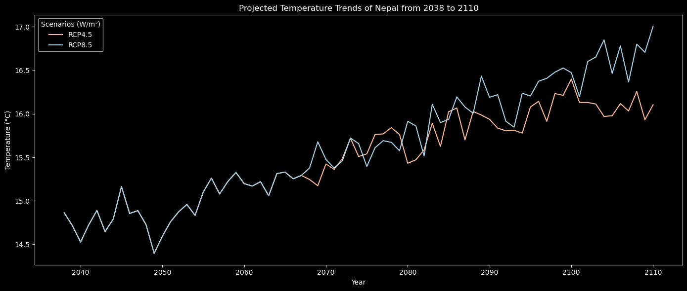
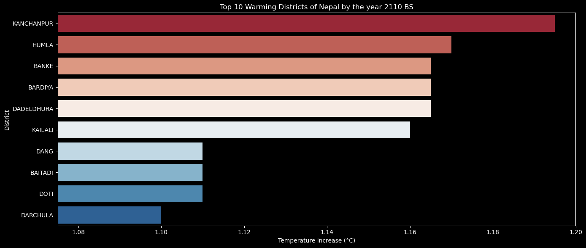
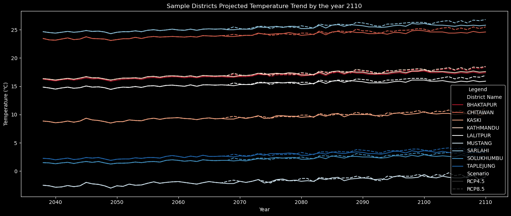

# 🌡️ Nepal Temperature - Exploratory Data Analysis

This project analyzes the **average annual temperature trends** across Nepal’s 77 districts from **2038 to 2110 BS**, under two climate scenarios: **RCP4.5** (moderate emissions) and **RCP8.5** (high emissions). The goal is to explore patterns, project future trends, and highlight vulnerable regions.

---

## 📁 Project Structure

├── data/
│ └── district_avg_annual_temp_nepal.xlsx
├── figures/
│ ├── boxplot_top_warming_districts.png
│ ├── lineplot_district_wise_temperature_trend.png
│ └── lineplot_national_temperature_trend.png
├── scripts/
│ ├── utils.py # Data preprocessing functions
│ └── figures.py # All plot functions
├── nepal_temperature_analysis.ipynb
├── requirements.txt
├── Readme.md
└── .gitignore

---

## 🧪 Dataset

- 📂 **district_avg_annual_temp_nepal.xlsx**
- Covers **77 districts** from **2038 to 2110 BS**
- Includes **historical data (2038–2067)** and **projected data (2068–2110)**
- Scenarios: **RCP4.5** and **RCP8.5**

---

## 🛠️ Libraries Used

- `pandas` – for data manipulation
- `seaborn`, `matplotlib` – for visualizations

📌 Dark theme applied: `plt.style.use("dark_background")`

---

## 🚀 How to Run

1. Clone the repo
2. Install dependencies
   ```bash
   pip install -r requirements.txt
   ```
3. Run the notebook
   ```bash
   jupyter notebook nepal_temperature_analysis.ipynb
   ```

---

## 📊 Visualizations Created

- 📈 **National average temperature trend (2038–2110)**
- 📉 **Top 10 warming districts** (temperature delta till 2110)
- 📍 **District-wise temperature projection** (sample of 10 districts)

🖼️ All visualizations are saved in the `figures/` directory.

---

## 📊 Insights from Temperature Trends in Nepal (2038–2110)

### 🔸 1. Warming Trend Under Both Scenarios

Nepal exhibits a **consistent upward trend in average annual temperatures** across all districts from **2038 to 2110 BS**, regardless of the emissions scenario:

- Under **RCP4.5** (moderate emissions), the warming is **gradual and steady**, reflecting a controlled climate trajectory.
- Under **RCP8.5** (high emissions), the increase is **more accelerated**, with a **notable surge after 2080 BS**, marking the impact of unchecked emissions.

📌 By **2110 BS**, the **national average temperature under RCP8.5 is nearly 1°C higher** than under RCP4.5 — highlighting the **critical role of emission mitigation** in shaping long-term climate outcomes.


_Figure: National average temperature trend under RCP4.5 vs RCP8.5 scenarios._

---

### 🔸 2. Top Warming Districts

Analysis of district-level projections reveals a **cluster of high-impact zones**:

- The **Top 10 most warming districts** include: **Kanchanpur, Humla, Banke, Bardiya**, and **Dadeldhura**.
- These areas show a **temperature increase between ~1.10°C and 1.19°C** when comparing historical averages (2038–2067) with future projections (2068–2110).

**Geographic distribution:**

- Concentrated in **mid- to far-western Nepal**, covering both **Terai lowlands and mid-hill regions**.
- This pattern suggests **regional sensitivity to climate change**, possibly influenced by topography, land use, and baseline climate conditions.

📌 **Kanchanpur** emerges as the **most rapidly warming district**, indicating **heightened vulnerability**, which may stem from local geographic or environmental characteristics (e.g., proximity to plains, urban development, deforestation).


_Figure: Temperature increase (~2038–2110) in the top 10 most affected districts._

---

### 🔸 3. District-Level Trends (Sampled View)

A closer look at a selection of representative districts reveals **varied but upward warming trajectories**:

- **Urban valley zones** like **Kathmandu, Lalitpur**, and **Bhaktapur** maintain **high but relatively stable baseline temperatures**, reflecting the heat retention typical of dense urban environments.
- **Mountainous districts** such as **Mustang** and **Solukhumbu** begin with **lower baseline temperatures** but show **steeper relative increases**, suggesting that **even cooler regions are not immune** to rising heat levels.

The **temperature gap between RCP4.5 and RCP8.5 scenarios begins to widen significantly after 2080 BS**, particularly in:

- **Terai** districts — already hot, with growing climate stress
- **Mid-hill regions** — facing ecological shifts and water resource pressure

📌 This divergence reinforces the importance of scenario-based planning for adaptation and resilience.


_Figure: Sample district-level temperature projections showing divergent trends post-2080 BS._

---

## ✅ Conclusion

The data clearly shows that **Nepal is warming across all districts**, with **no region untouched** by climate change.

- **RCP8.5 leads to significantly more severe outcomes**, especially in the latter half of the century.
- The **Western and Terai regions** are projected to face the **highest increases in temperature**, putting **agriculture, water resources, biodiversity, and public health at risk**.

🕒 **Early signs of scenario divergence** begin around **2068 BS**, aligning with the **transition from historical data to model-based projections**.

📌 **Policy action and mitigation efforts before 2067 BS** will be **pivotal in shaping Nepal’s climate future**. The visualizations underscore the **urgent need for data-informed, climate-conscious strategies** to safeguard both people and ecosystems.

---
